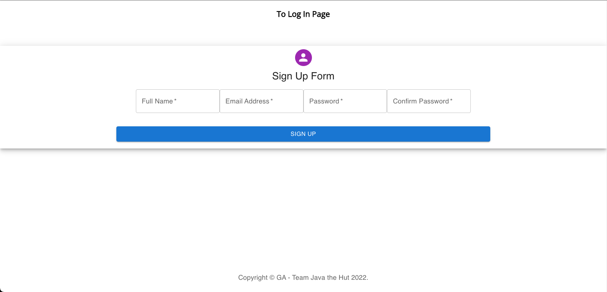
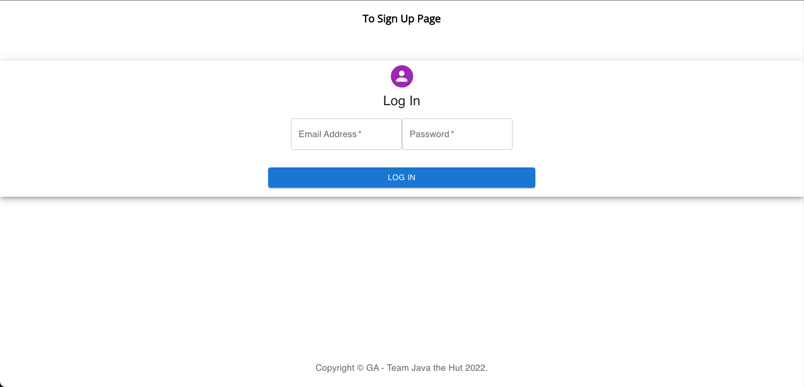
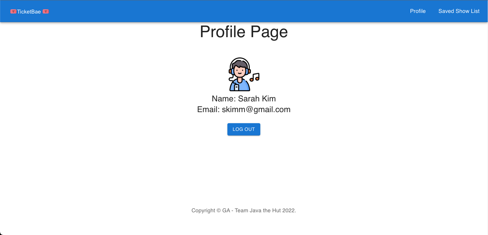
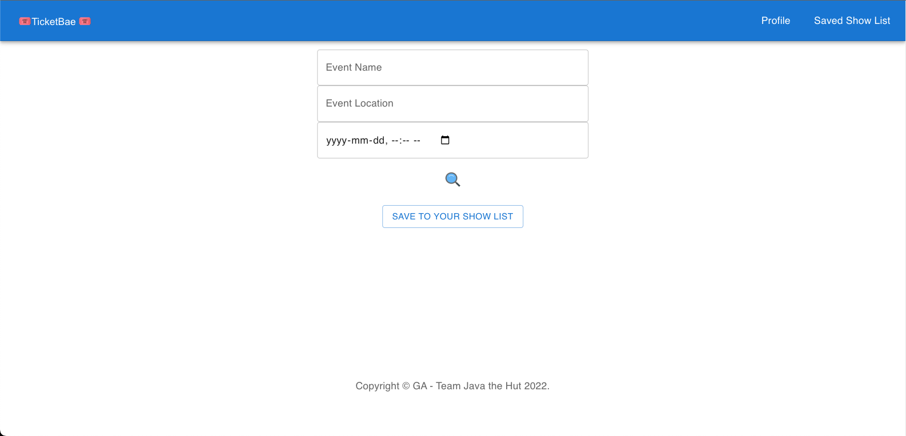
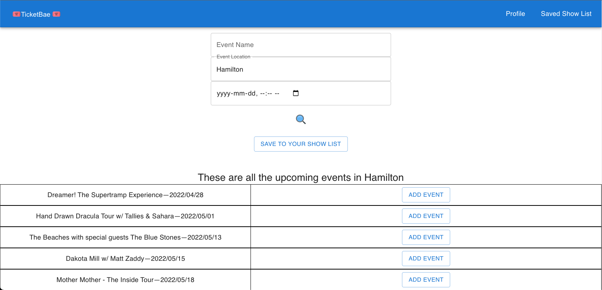
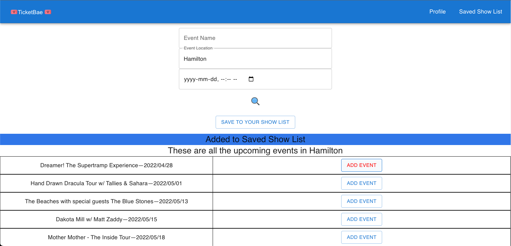
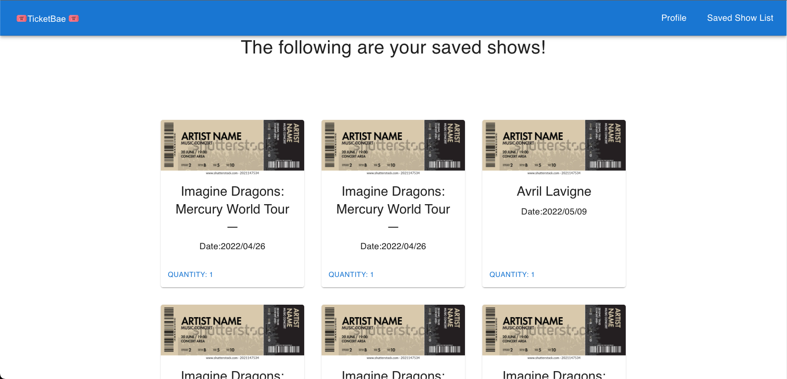

# **TicketBae**

Tired of looking for your favourite concert on other ticket markerplaces? Look no further! TicketBae allows users to search for upcoming shows depending on the artist, location, or date and save them to your specially curated "Saved Show List".

---

### **Collaborators**

This project was created in collaboration with:

- [Zahra Abdulrashid](https://github.com/zarax7)

---

### **Screenshots**

---

### **Technologies Used**

- Javascript
- HTML
- CSS (Grid, Flexbox)
- MongoDB
- Express
- React
- Node.js
- Ticketmaster API
- MaterialUI
- Visual Studio Code
- AWS
- MongoDB Atlas

---

### **Getting Started**

http://54.242.115.104:3001/

To start using TicketBae, a log in or sign up is required. From there, users will be redirected to the TicketBae main page where events can be searched.

The search result will display a list of events, which the user can "add" to their show list. Don't forget to hit the "Save to Show List" button once all your favourite shows are added!

Added shows will be saved, which can be viewed even if the user logs out.

---

### **Next Steps**

- Correct date format.
- Delete functionality - allows tickets to be removed if user no longer wants to save the added show.
- Cards displaying events in "Saved Show List page" - instead of displaying a generic ticket photo, the associated artist photo will be displayed.
